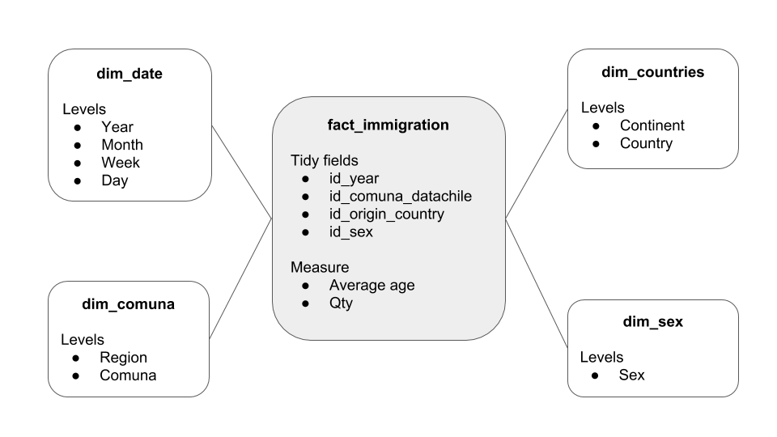

[Volver al índice](general.md)

# Sobre la base de datos

1.	La base de datos relacional es [Postgres](https://www.postgresql.org).
2.	El diagrama de estrella para una base de datos relacional organiza la información pensando en que:
* En el centro estará la tabla de `facts`: los hechos. Las measures y datos a ser agregados más los campos de referencia tidy son parte de esta tabla.
* En las puntas de la estrella estarán las tablas de `dimensiones` relacionadas. Estas dimensiones serán mapeadas en el `schema.xml` y puedem ser compartidas entre varios cubos -como el caso de la dimensión geográfica-.

Ejemplo de diagrama para el cubo de inmigración:

