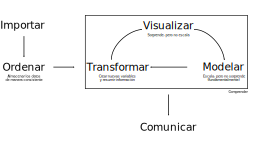
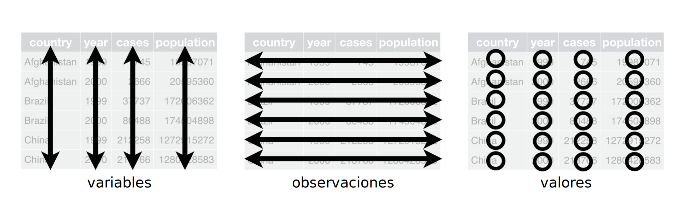

# Tidy Data

[Volver al índice](general.md)

La filosofía detrás de los datos del proyecto es la de Tidy Data. El flujo de trabajo de Tidy Data se resume en el siguiente diagrama.

Determinada información se puede representar de múltiples formas. El siguiente ejemplo muestra la misma información organizada en dos tablas distintas. Cada dataset muestra las mismas cuatro variables país, año, población y PIB per cápita, pero cada dataset está organizado de una forma diferente.

|country                  | year|        pop|  gdpPercap|
|:------------------------|----:|----------:|----------:|
|Afghanistan              | 2002|   25268405|   726.7341|
|Afghanistan              | 2007|   31889923|   974.5803|
|Albania                  | 2002|    3508512|  4604.2117|
|Albania                  | 2007|    3600523|  5937.0295|
|Algeria                  | 2002|   31287142|  5288.0404|
|Algeria                  | 2007|   33333216|  6223.3675|
|Angola                   | 2002|   10866106|  2773.2873|
|Angola                   | 2007|   12420476|  4797.2313|
|Argentina                | 2002|   38331121|  8797.6407|
|Argentina                | 2007|   40301927| 12779.3796|

|country                  | year|variable  |        value|
|:------------------------|----:|:---------|------------:|
|Afghanistan              | 2002|pop       | 2.526840e+07|
|Afghanistan              | 2007|pop       | 3.188992e+07|
|Albania                  | 2002|pop       | 3.508512e+06|
|Albania                  | 2007|pop       | 3.600523e+06|
|Algeria                  | 2002|pop       | 3.128714e+07|
|Algeria                  | 2007|pop       | 3.333322e+07|
|Angola                   | 2002|pop       | 1.086611e+07|
|Angola                   | 2007|pop       | 1.242048e+07|
|Argentina                | 2002|pop       | 3.833112e+07|
|Argentina                | 2007|pop       | 4.030193e+07|

Estas representaciones (acortadas por razones de espacio) representan la misma información, pero no son igualmente fáciles de usar. Nos limitamos sólo a población podríamos tener lo siguiente.

|country                  |variable |       2002|       2007|
|:------------------------|:--------|----------:|----------:|
|Afghanistan              |pop      |   25268405|   31889923|
|Albania                  |pop      |    3508512|    3600523|
|Algeria                  |pop      |   31287142|   33333216|
|Angola                   |pop      |   10866106|   12420476|
|Argentina                |pop      |   38331121|   40301927|
|Australia                |pop      |   19546792|   20434176|
|Austria                  |pop      |    8148312|    8199783|
|Bahrain                  |pop      |     656397|     708573|
|Bangladesh               |pop      |  135656790|  150448339|
|Belgium                  |pop      |   10311970|   10392226|

Existen tres reglas que determinan si acaso un dataset cumple con la filosofía de Tidy Data:

1. Cada variable corresponde a una columna
2. Cada observación corresponde a una fila
3. Cada valor corresponde a una celda

