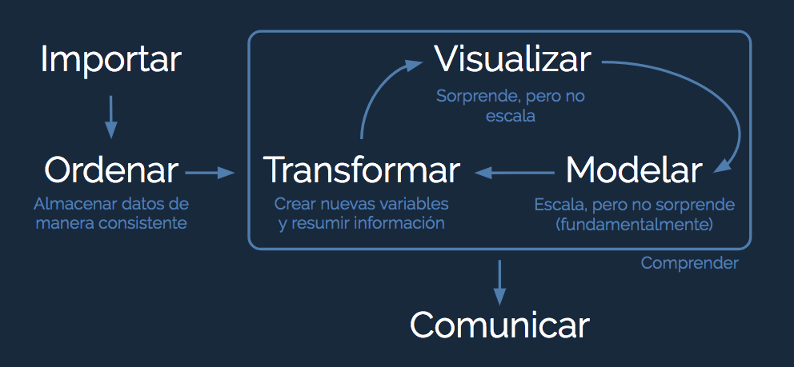

[Volver al índice](general.md)

# Sobre Tidy Data

Para que un dataset clasifique como Tidy Data debe cumplir algunas reglas:
* Cada columna es una variable
* Cada fila es una observación
* Cada celda contiene únicamente un dato
